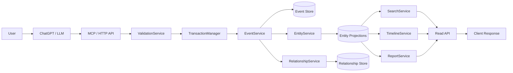

# Relationship OS Architecture

## 1. Architectural principles

Relationship OS should be designed as an AI-native knowledge repository with a clear separation between:

- commands and writes
- immutable history
- materialized projections
- read models and derived views

The guiding rule is:

- The event log is the source of truth.
- Entities, relationships, timelines, and reports are projections built from events.

This keeps the system auditable, explainable, and easier to evolve over time.

## 2. Core domain model

### Canonical objects

- Entity: a business object such as a Client, Company, Booking, Invoice, Task, or Payment.
- Event: an immutable record describing a state-changing action.
- Relationship: a typed link between two entities.
- Schema: the definition of what an entity type is allowed to look like.
- Workspace: the logical boundary for a knowledge graph instance.

### Identity rules

- Every entity, event, and relationship gets an immutable UUID.
- Relationships reference entity IDs, never names.
- Names are labels only and may change over time.
- The canonical key for deduplication is based on type + normalized name + workspace, not the display name alone.

## 3. Write flow

The intended write path is:

1. User submits a request.
2. ChatGPT or another LLM interprets the request into a structured intent.
3. The MCP layer or HTTP endpoint receives the command.
4. Validation validates the command and the proposed state change.
5. A transaction boundary begins.
6. The system appends an immutable event to the event store.
7. Projection handlers update entity and relationship state.
8. The response is returned to the caller with relevant entity and event details.

In simplified form:

```text
User -> ChatGPT -> MCP/HTTP -> Validation -> Transaction -> Event Store -> Projections -> Response
```

## 4. Validation strategy

Validation should be layered and explicit.

### Layer 1: schema validation

- Enforce request shape with Zod or a similar schema validator.
- Reject missing required fields, invalid enumerations, and malformed payloads.

### Layer 2: domain validation

- Ensure entity type is supported.
- Prevent duplicate entities when a matching canonical identity already exists.
- Validate that a relationship refers to real entity IDs.
- Check that relationship types are allowed for the given entity types.
- Reject conflicting writes when the same entity is updated concurrently.

### Layer 3: intent validation

- Require an explicit action such as create, update, link, or unlink.
- Require a clear target entity or a resolved entity ID.
- Use an idempotency key when possible to prevent duplicate AI writes.

### Guardrails for ambiguous AI writes

- AI tools should not be allowed to write to arbitrary names without a resolved identity.
- When the model is uncertain, the write should fail closed rather than guessing.
- The system should prefer explicit entity IDs over fuzzy name matching.
- If a write is ambiguous, return a validation error and ask for clarification.

## 5. Service responsibilities

The current KnowledgeEngine is doing both orchestration and some domain logic. For long-term maintainability, responsibilities should be split.

### Proposed services

- ValidationService: schema checks, entity identity rules, relationship rules, conflict detection
- EventService: append events, read event streams, enforce immutability
- EntityService: create/update entity projections, maintain entity state
- RelationshipService: create/remove relationships and enforce graph rules
- SearchService: search entities and relationships
- TimelineService: build entity timelines from events
- ReportService: generate summaries and reporting views
- TransactionManager: coordinate multi-step writes and rollback behavior

### Recommended direction

- Keep KnowledgeEngine as a thin orchestration façade for the v1 API surface.
- Move business logic into the dedicated services above.

## 6. Event-first storage model

### Source of truth

The event log remains the authoritative history.

### Materialized state

Entities and relationships should be materialized from events so that reads stay fast.

### Why this is a good fit

- easy auditing
- full replay capability
- safer evolution of business rules
- straightforward support for timelines and reports

## 7. Timeline and history

### Recommended approach

- Every entity should have an event stream.
- Timelines should be generated from the event stream by default.
- For performance, a per-entity timeline index or materialized timeline view can be added later.

This gives a clean model:

- event history = authoritative
- timeline = derived view

## 8. Reports and derived views

### Recommended approach

- Reports should be computed on demand for v1.
- If report volume becomes significant, maintain summary tables or materialized views for high-frequency queries.

Examples:

- activity summary
- entity counts by type
- relationship counts by type
- recent changes by workspace

## 9. Scaling plan

For millions of events, the design should evolve in stages.

### Phase 1: simple append-only store

- event table or append-only log
- entity and relationship projections stored in row-based tables
- basic indexes on entity ID, type, name, and created timestamps

### Phase 2: read model optimization

- maintain denormalized tables for search and reporting
- add caching for hot queries
- precompute summaries for common reports

### Phase 3: large-scale architecture

- partition event data by time or workspace
- use snapshots for projection rebuilds
- add queue-based projection workers if needed
- separate write and read paths where necessary

## 10. Schema evolution and migrations

Schema changes should be versioned and backward compatible.

### Rules

- Additive changes are preferred over breaking changes.
- Every schema change should include a migration.
- Existing data must remain readable after a migration.
- New entity definitions should be versioned.

### Recommended approach

- Keep migrations in SQL under a migrations directory.
- Track schema version in the database.
- For entity definitions, maintain a definition version plus a compatibility layer.
- When a definition changes, apply a migration and backfill affected records where necessary.

## 11. GitHub usage

GitHub should be used for:

- source code
- tests
- migrations
- documentation
- deployment configuration
- CI/CD workflows

GitHub should not be used as the primary storage location for business data. Business data should live in the application database or a proper storage backend.

## 12. v1 scope

The first version should stay intentionally narrow.

### In scope for v1

- MCP and HTTP entrypoints
- entity and relationship creation
- event storage and basic projections
- search, timeline, and simple reports
- validation and transactional writes

### Out of scope for v1

- authentication and user accounts
- role-based permissions
- multi-workspace collaboration
- vector search and embeddings
- plugin ecosystems
- advanced analytics
- external integrations
- complex workflow engines

## 13. Component diagram



## 14. Recommended implementation path for this repository

The current repository already has a strong starting point:

- [src/services/knowledgeEngine.ts](src/services/knowledgeEngine.ts)
- [src/services/transactionManager.ts](src/services/transactionManager.ts)
- [src/lib/schema.ts](src/lib/schema.ts)
- [src/types/index.ts](src/types/index.ts)

The next step should be to refactor the current engine into a service-oriented structure while preserving the existing MCP and HTTP interfaces.

## 15. Final recommendation

Adopt an event-first architecture for the long term, but keep the current entity projection model in place for fast reads and a simpler v1 implementation. That gives the project a clean foundation without overcomplicating the initial build.
